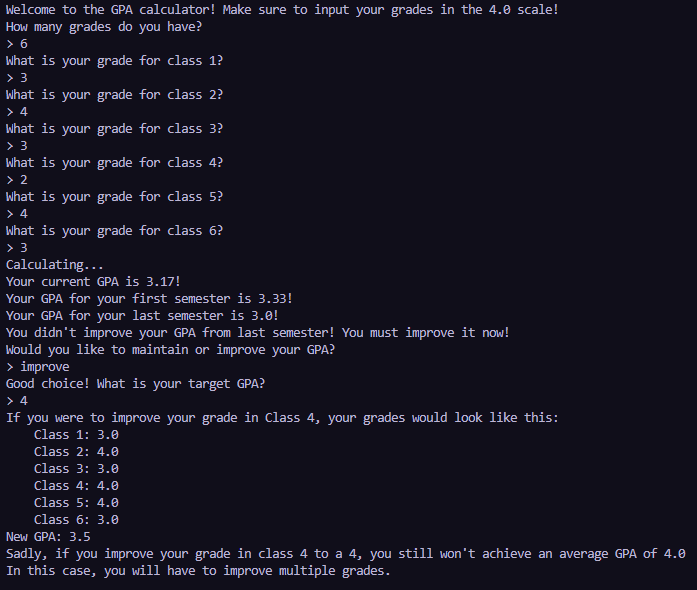
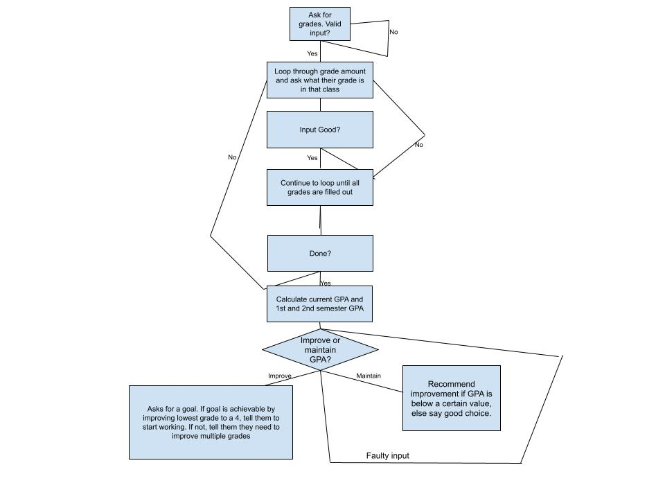

# GPA Calculator

A Python script that helps students calculate their GPA, analyze semester performance, and explore strategies for maintaining or improving their GPA.

## Features

- Calculates your overall GPA based on a 4.0 scale.  
- Splits your grades into first and last semester to show semester-wise performance.  
- Provides personalized feedback based on your GPA improvement or consistency.  
- Suggests which grades to improve to reach a target GPA.  
- Handles invalid inputs gracefully.  

## Requirements

- Python 3.x  
- Built in Time library

## How to Use
1. Run the script:
    - ```python gpa_calculator.py ``` 
2. Input the number of grades you have when prompted.
3. Enter each grade on a 4.0 scale (e.g., 3.5, 4.0, 2.7).
4. The program will calculate and display:
    - Your overall GPA
    - GPA for the first and last semester
    - Feedback on your GPA trends
5. If your GPA is below 4.0, the program will ask if you want to maintain or improve it.
6. If you choose to improve, enter your target GPA, and the program will suggest which grade(s) to improve to reach your goal.

## Notes

- Grades must be between 0 and 4.0.
- If an invalid input is entered, the program will prompt for correction.
- The GPA calculation assumes equal weighting for all courses.
- This calculation also assumes that your grades are split up into 2 semesters.

## Example Run-Through


## Flowchart 
